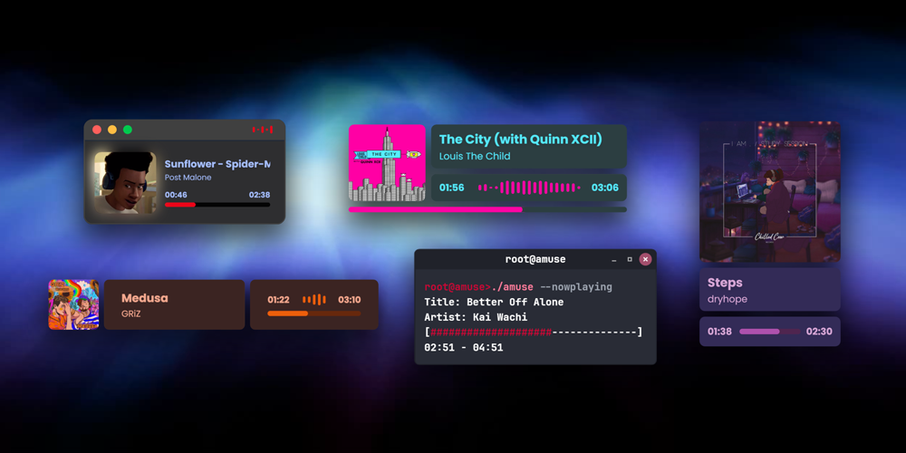

# BetterNCM-6K-Labs

  
_preview image from [6K Labs](https://6klabs.com/)_

Powered by [InfLink-rs](https://github.com/apoint123/inflink-rs) and a Rust native HTTP server injected into NCM.

Inspired by [Widdit/now-playing-service](https://github.com/Widdit/now-playing-service)

Special thanks: [BetterNCM/InfinityLink](https://github.com/BetterNCM/InfinityLink) & [std-microblock/LiveSongPlayer-MKII](https://github.com/std-microblock/LiveSongPlayer-MKII)

## V1 Update

通过 AI 的帮助，我把 HTTP 服务器的实现方案换成了注入网易云进程中的 Rust 程序，现在不需要再去起一个外部进程且在 BetterNCM 中这么受限的 API 中去管理它了。可能减少了一点资源占用，减少了一点 Bug，提高了一些可维护性喵~

同时把数据源换成了 InfLink-rs，借助它，我们更轻松地适配了 v3 新版客户端喵~

## Why this?

此项目适合仅展示网易云播放状态需求的用户，它比起 NowPlaying 来说，少了一个程序常驻在后台，更轻量省资源。
